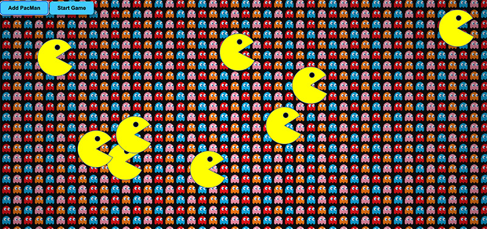

<div align="center" id="top"> 
  

  &#xa0;

  <!-- <a href="https://pacman.netlify.app">Demo</a> -->
</div>

<h1 align="center">PacMen Exercise</h1>

<p align="center">
  

  

  

  

  <!--  -->

  <!--  -->

  <!--  -->
</p>

<!-- Status -->

<!-- <h4 align="center"> 
	🚧  Pacman 🚀 Under construction...  🚧
</h4> 

<hr> -->
<p align="center" style="padding:15px;">
  
</p>

<p align="center">
  <a href="#dart-about">About</a> &#xa0; | &#xa0; 
  <a href="#sparkles-features">Features</a> &#xa0; | &#xa0;
  <a href="#rocket-technologies">Technologies</a> &#xa0; | &#xa0;
  <a href="#white_check_mark-requirements">Requirements</a> &#xa0; | &#xa0;
  <a href="#checkered_flag-how-to-run">How to run</a> &#xa0; | &#xa0;
    <a href="#calendar-roadmap-of-future-improvements">Roadmap</a> &#xa0; | &#xa0;
  <a href="#memo-license">License</a> &#xa0; | &#xa0;
  <a href="https://github.com/agusroig" target="_blank">Author</a>
</p>

<br>

## :dart: About ##

This project was made for MITxPro web developer certification. This is a Factory for making pacmen.
When button "make one" is pressed a new PacMan is added to the window, you can add as many as you want.
When you click the start game button they start to move and reverse the motion when they hit the edges.

[live project](https://agusroig.github.io/PacMen-Exercise/)  

## :sparkles: Features ##

:heavy_check_mark: Create Animated Pacmen

:heavy_check_mark: Turns around when hitting edges

## :rocket: Technologies ##

The following tools were used in this project:

- [HTML](https://developer.mozilla.org/en-US/docs/Learn/Getting_started_with_the_web/HTML_basics)
- [CSS](https://developer.mozilla.org/en-US/docs/Web/CSS)
- [JavaScript](https://www.javascript.com/)

## :white_check_mark: Requirements ##

Before starting :checkered_flag:, you need to have [Git](https://git-scm.com) and [Node](https://nodejs.org/en/) installed.

## :checkered_flag: How to run ##

```bash
# Clone this project
$ git clone https://github.com/agusroig/PacMen-Exercise.git

# Access
$ cd PacMen-Exercise

```

## :calendar: Roadmap of future improvements ##

| Status                        | Goal          | label  |
| ------------- |:-------------:| -----:|
| alternate images  | :hourglass_flowing_sand: | coming soon |

## :memo: License ##

This project is under license from MIT. For more details, see the [LICENSE](LICENSE.md) file.


Made with :heart: by <a href="https://github.com/agusroig" target="_blank">Maria Agustina Roig</a>

&#xa0;

<a href="#top">Back to top</a>
